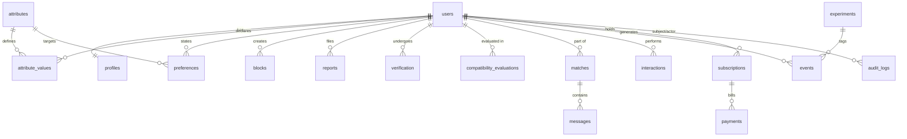

# DATA_MODEL.md

> **Status:** DRAFT v0.2 — not accepted. Target: PostgreSQL (spec §21). No migrations exist yet;
> DDL below is illustrative and will be written as versioned migrations in Phase 1.

## 1. Principles

- Normalised; no wide `users` table holding every attribute (spec §21).
- Attribute **definitions** (registry) separate from attribute **values** (per user).
- Self-description, preferences, requirements and dealbreakers are separate records (spec §5).
- Sensitive values carry per-user permissions (spec §19); highly sensitive values are encrypted at
  the application layer (key management **[OPEN D-08]**).
- Payment tables have no foreign keys read by matching code (spec §33).
- All admin actions write to `audit_logs` (spec §34).

## 2. Entity overview



## 3. Tables (spec §21 list)

| Table | Purpose | Key columns |
| :--- | :--- | :--- |
| `users` | Account & auth identity only | id, email (unique), auth fields, status, created_at |
| `profiles` | Display profile shell | user_id, display_name, bio, photos ref, visibility, updated_at |
| `attributes` | Attribute registry (ATTRIBUTE_DICTIONARY §1) | id, category, value_type, allowed_values, all capability flags, privacy_level |
| `attribute_values` | What a user **is** | user_id, attribute_id, value (typed jsonb), source, confidence, permissions (§4), encrypted_value |
| `preferences` | What a user **wants** | user_id, attribute_id, value, importance, requirement_level, flexibility, dealbreaker, privacy_setting |
| `requirements` | `MUST` constraints | see D-15 |
| `dealbreakers` | explicit exclusion flags | see D-15 |
| `matches` | Mutual like → connection | id, user_low, user_high, state, created_at |
| `compatibility_evaluations` | Stored engine outputs for audit/diagnostics | pair, ruleset_version, eligible, scores jsonb, evaluated_at |
| `interactions` | like / pass / unmatch actions | actor, target, type, created_at |
| `messages` | Messaging | match_id, sender_id, body (encrypted?), created_at |
| `reports` | Safety reports | reporter, reported, reason, status, reviewer, resolved_at |
| `blocks` | Blocks (bidirectional effect) | blocker, blocked, created_at |
| `verification` | Verification attempts/status | user_id, type, status, provider ref, reviewed_by |
| `subscriptions` | Plan state | user_id, plan, status, period |
| `payments` | Payment records | subscription_id, provider ref, amount, status |
| `experiments` | Experiment definitions & assignments | id, name, variants, assignment rules |
| `events` | Product events (§22) | user_id, type, properties jsonb, experiment_id, created_at |
| `audit_logs` | Append-only admin/system audit | actor, action, target, before/after hash, created_at |

**[OPEN D-15] Requirements & dealbreakers storage.** Spec §4 puts `requirement_level` and
`dealbreaker` on each preference, while §21 asks for separate `requirements` and `dealbreakers`
tables. Storing them twice risks inconsistency. Proposal: `preferences` is the single source of
truth; `requirements` and `dealbreakers` are **views** (`WHERE requirement_level='MUST'` /
`WHERE dealbreaker`). Needs confirmation.

## 4. Representing spec §5

```sql
-- "I am vegetarian."
INSERT INTO attribute_values (user_id, attribute_id, value) VALUES (:a, 'diet', '"vegetarian"');
-- "I prefer vegetarian partners." (importance 4, flexibility 70)
INSERT INTO preferences (user_id, attribute_id, value, requirement_level, importance, flexibility, dealbreaker)
VALUES (:a, 'diet', '["vegetarian"]', 'PREFERENCE', 4, 70, false);
-- "I require vegetarian partners."
--   ... requirement_level = 'MUST'
-- "I don't care."
--   ... requirement_level = 'NEUTRAL'
-- No statement → no row → UNKNOWN
```

## 5. Core DDL sketch

```sql
CREATE TYPE requirement_level AS ENUM ('MUST','STRONG_PREFERENCE','PREFERENCE','NEUTRAL','AVOID','UNKNOWN');

CREATE TABLE users (
  id uuid PRIMARY KEY DEFAULT gen_random_uuid(),
  email citext UNIQUE NOT NULL,
  status text NOT NULL DEFAULT 'active',
  created_at timestamptz NOT NULL DEFAULT now(),
  updated_at timestamptz NOT NULL DEFAULT now()
);

CREATE TABLE attributes (
  id text PRIMARY KEY,
  name text NOT NULL,
  category smallint NOT NULL CHECK (category BETWEEN 1 AND 48),
  description text,
  value_type text NOT NULL,
  allowed_values jsonb,
  user_visible boolean NOT NULL DEFAULT true,
  required boolean NOT NULL DEFAULT false,
  optional boolean NOT NULL DEFAULT true,
  sensitive boolean NOT NULL DEFAULT false,
  highly_sensitive boolean NOT NULL DEFAULT false,
  searchable boolean NOT NULL DEFAULT false,
  filterable boolean NOT NULL DEFAULT false,
  matchable boolean NOT NULL DEFAULT false,
  hard_constraint_capable boolean NOT NULL DEFAULT false,
  preference_capable boolean NOT NULL DEFAULT false,
  weightable boolean NOT NULL DEFAULT false,
  privacy_level text NOT NULL DEFAULT 'matches_only',
  verification_possible boolean NOT NULL DEFAULT false,
  source text NOT NULL DEFAULT 'self_declared',
  confidence text,
  created_at timestamptz NOT NULL DEFAULT now(),
  updated_at timestamptz NOT NULL DEFAULT now(),
  CHECK (required <> optional),
  CHECK (NOT highly_sensitive OR sensitive)
);

CREATE TABLE attribute_values (
  user_id uuid NOT NULL REFERENCES users(id) ON DELETE CASCADE,
  attribute_id text NOT NULL REFERENCES attributes(id),
  value jsonb,                 -- null when encrypted_value is used
  encrypted_value bytea,       -- highly sensitive attributes
  source text NOT NULL DEFAULT 'self_declared',
  perm_store boolean NOT NULL DEFAULT true,
  perm_display boolean NOT NULL DEFAULT false,
  perm_searchable boolean NOT NULL DEFAULT false,
  perm_matchable boolean NOT NULL DEFAULT false,
  perm_private boolean NOT NULL DEFAULT true,
  verified_status text NOT NULL DEFAULT 'unverified',
  updated_at timestamptz NOT NULL DEFAULT now(),
  PRIMARY KEY (user_id, attribute_id)
);

CREATE TABLE preferences (
  user_id uuid NOT NULL REFERENCES users(id) ON DELETE CASCADE,
  attribute_id text NOT NULL REFERENCES attributes(id),
  value jsonb,
  importance smallint CHECK (importance BETWEEN 1 AND 5),
  requirement_level requirement_level NOT NULL,
  flexibility smallint NOT NULL DEFAULT 0 CHECK (flexibility BETWEEN 0 AND 100),
  dealbreaker boolean NOT NULL DEFAULT false,
  privacy_setting text NOT NULL DEFAULT 'private',
  updated_at timestamptz NOT NULL DEFAULT now(),
  PRIMARY KEY (user_id, attribute_id)
);

CREATE TABLE blocks (
  blocker_id uuid NOT NULL REFERENCES users(id) ON DELETE CASCADE,
  blocked_id uuid NOT NULL REFERENCES users(id) ON DELETE CASCADE,
  created_at timestamptz NOT NULL DEFAULT now(),
  PRIMARY KEY (blocker_id, blocked_id),
  CHECK (blocker_id <> blocked_id)
);

CREATE TABLE audit_logs (
  id bigserial PRIMARY KEY,
  actor_id uuid,
  actor_role text NOT NULL,
  action text NOT NULL,
  target_type text NOT NULL,
  target_id text,
  detail jsonb,
  created_at timestamptz NOT NULL DEFAULT now()
);
-- audit_logs: application role has INSERT only (no UPDATE/DELETE).
```

Privacy-permission defaults above are deliberately conservative (not displayed, not matchable)
until the user opts in. **[OPEN D-16]** whether non-sensitive attributes default to matchable.

Whether "unknown" needs a stored marker vs. absence of a row: proposed **absence = unknown**;
explicit "prefer not to say" stored as a distinct value that is treated as UNKNOWN by the engine.

## 6. Events (spec §22) and retention

Event types: `profile_view, like, pass, mutual_like, message_sent, message_received,
conversation_started, conversation_continued, unmatch, block, report, date_intent, date_completed,
second_date, relationship_feedback`. Message content is **not** copied into events. Retention
periods per event type and for sensitive data are **[OPEN D-17]** (legal input needed).

## 7. Outcome pipeline (spec §23)

Recommendation → mutual match → conversation → sustained conversation → date → second date →
user feedback → optional relationship outcome. Each stage is derived from `events`; no outcome
probabilities are shown to users.
