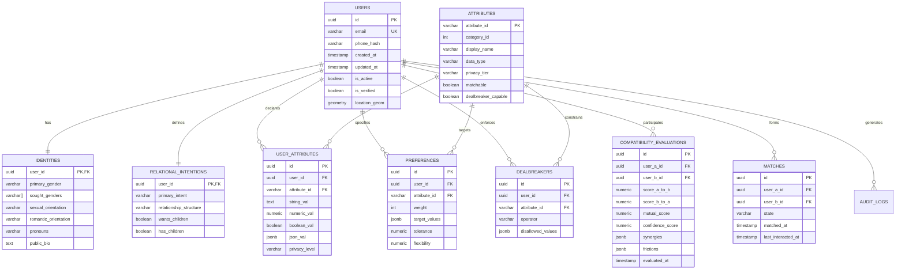

# Universal Compatibility & Matching Platform: Data Model & Schema Specification
**Document Version:** 1.0.0  
**Status:** Canonical Database Schema Specification  
**Database Target:** PostgreSQL 16+ with PostGIS & pgvector Extensions  
**Governing Standard:** Section 6 & Section 41 of Master Build Specification  

---

## 1. Architectural Data Strategy

The data model resolves the tension between rigorous relational integrity (for privacy, security, and hard constraints) and dynamic ontological flexibility (supporting 48 multi-modal categories with evolving attributes).

### Core Design Rules
1. **Strong Types for Hard Gating:** Essential eligibility attributes (gender, sexual orientation, age, spatial coordinates, hard dealbreakers) are stored in first-class strongly-typed relational columns with PostGIS GiST and B-Tree indexes.
2. **Hybrid Entity-Attribute-Value with Typed JSONB:** Secondary and expansive lifestyle, cognitive, and cultural attributes are modeled in a high-performance normalized attribute schema with GIN-indexed JSONB for multi-select sets.
3. **Multi-Tier Privacy & Column Encryption:** Tier 4 attributes (sexual health, sensitive neurodivergence accommodations) utilize PostgreSQL pgcrypto or application-level AES-256-GCM field encryption.
4. **Time-Based Partitioning:** High-volume evaluation caches and audit logs are partitioned monthly with automated TTL pruning.

---

## 2. Entity-Relationship Topology



---

## 3. Physical DDL Schema Definitions

```sql
-- Enable PostGIS & Cryptographic extensions
CREATE EXTENSION IF NOT EXISTS postgis;
CREATE EXTENSION IF NOT EXISTS pgcrypto;

-- 1. Core Users Table
CREATE TABLE users (
    id UUID PRIMARY KEY DEFAULT gen_random_uuid(),
    email VARCHAR(255) NOT NULL UNIQUE,
    password_hash VARCHAR(255) NOT NULL,
    birthdate DATE NOT NULL,
    is_active BOOLEAN NOT NULL DEFAULT TRUE,
    is_verified BOOLEAN NOT NULL DEFAULT FALSE,
    verification_tier INT NOT NULL DEFAULT 1,
    location_geom GEOMETRY(Point, 4326),
    location_fuzzed GEOMETRY(Point, 4326),
    max_discovery_distance_km INT NOT NULL DEFAULT 50,
    created_at TIMESTAMPTZ NOT NULL DEFAULT NOW(),
    updated_at TIMESTAMPTZ NOT NULL DEFAULT NOW()
);

CREATE INDEX idx_users_location_geom ON users USING GIST (location_geom);
CREATE INDEX idx_users_location_fuzzed ON users USING GIST (location_fuzzed);
CREATE INDEX idx_users_active_verified ON users (is_active, is_verified);

-- 2. Core Identities Table (High-Frequency Stage 1 Eligibility Filtering)
CREATE TABLE identities (
    user_id UUID PRIMARY KEY REFERENCES users(id) ON DELETE CASCADE,
    primary_gender VARCHAR(64) NOT NULL,
    gender_presentation VARCHAR(64),
    sought_genders VARCHAR(64)[] NOT NULL,
    sexual_orientation VARCHAR(64) NOT NULL,
    romantic_orientation VARCHAR(64) NOT NULL,
    pronouns VARCHAR(64) NOT NULL,
    public_bio TEXT,
    height_cm INT,
    created_at TIMESTAMPTZ NOT NULL DEFAULT NOW(),
    updated_at TIMESTAMPTZ NOT NULL DEFAULT NOW()
);

CREATE INDEX idx_identities_gender_filter ON identities (primary_gender);
CREATE INDEX idx_identities_sought_genders ON identities USING GIN (sought_genders);

-- 3. Relational Intentions Table
CREATE TABLE relational_intentions (
    user_id UUID PRIMARY KEY REFERENCES users(id) ON DELETE CASCADE,
    primary_intent VARCHAR(64) NOT NULL,
    intent_flexibility VARCHAR(64),
    relationship_structure VARCHAR(64) NOT NULL,
    wants_children VARCHAR(32) NOT NULL,
    has_children VARCHAR(32) NOT NULL,
    created_at TIMESTAMPTZ NOT NULL DEFAULT NOW(),
    updated_at TIMESTAMPTZ NOT NULL DEFAULT NOW()
);

CREATE INDEX idx_relational_intentions_core ON relational_intentions (primary_intent, relationship_structure, wants_children);

-- 4. Global Attribute Registry
CREATE TABLE attributes (
    attribute_id VARCHAR(64) PRIMARY KEY,
    category_id INT NOT NULL,
    display_name VARCHAR(128) NOT NULL,
    description TEXT,
    data_type VARCHAR(32) NOT NULL, -- 'boolean', 'categorical', 'multi_select', 'scalar', 'ordinal'
    privacy_tier VARCHAR(32) NOT NULL DEFAULT 'match_only', -- 'public', 'match_only', 'reciprocal', 'encrypted'
    matchable BOOLEAN NOT NULL DEFAULT TRUE,
    dealbreaker_capable BOOLEAN NOT NULL DEFAULT FALSE,
    mutuality_type VARCHAR(32) NOT NULL DEFAULT 'symmetric',
    default_weight INT NOT NULL DEFAULT 3,
    decay_curve VARCHAR(32) NOT NULL DEFAULT 'linear'
);

-- 5. User Attribute Values (Entity-Attribute-Value with Typed Storage)
CREATE TABLE user_attributes (
    id UUID PRIMARY KEY DEFAULT gen_random_uuid(),
    user_id UUID NOT NULL REFERENCES users(id) ON DELETE CASCADE,
    attribute_id VARCHAR(64) NOT NULL REFERENCES attributes(attribute_id) ON DELETE RESTRICT,
    string_val TEXT,
    numeric_val NUMERIC(10, 4),
    boolean_val BOOLEAN,
    json_val JSONB,
    encrypted_val BYTEA, -- For Tier 4 encrypted disclosures
    privacy_level VARCHAR(32) NOT NULL DEFAULT 'match_only',
    created_at TIMESTAMPTZ NOT NULL DEFAULT NOW(),
    updated_at TIMESTAMPTZ NOT NULL DEFAULT NOW(),
    CONSTRAINT uq_user_attribute UNIQUE (user_id, attribute_id)
);

CREATE INDEX idx_user_attributes_lookup ON user_attributes (user_id, attribute_id);
CREATE INDEX idx_user_attributes_jsonb ON user_attributes USING GIN (json_val);

-- 6. User Preferences
CREATE TABLE preferences (
    id UUID PRIMARY KEY DEFAULT gen_random_uuid(),
    user_id UUID NOT NULL REFERENCES users(id) ON DELETE CASCADE,
    attribute_id VARCHAR(64) NOT NULL REFERENCES attributes(attribute_id) ON DELETE RESTRICT,
    weight INT NOT NULL CHECK (weight BETWEEN 1 AND 5),
    target_values JSONB NOT NULL, -- e.g. ["atheist", "agnostic"] or {"target": 8, "min": 6, "max": 10}
    tolerance NUMERIC(8, 2) DEFAULT 0,
    flexibility NUMERIC(8, 2) DEFAULT 0,
    created_at TIMESTAMPTZ NOT NULL DEFAULT NOW(),
    updated_at TIMESTAMPTZ NOT NULL DEFAULT NOW(),
    CONSTRAINT uq_user_pref UNIQUE (user_id, attribute_id)
);

CREATE INDEX idx_preferences_user ON preferences (user_id);

-- 7. User Dealbreakers (Hard Constraints)
CREATE TABLE dealbreakers (
    id UUID PRIMARY KEY DEFAULT gen_random_uuid(),
    user_id UUID NOT NULL REFERENCES users(id) ON DELETE CASCADE,
    attribute_id VARCHAR(64) NOT NULL REFERENCES attributes(attribute_id) ON DELETE RESTRICT,
    operator VARCHAR(32) NOT NULL DEFAULT 'must_be_in', -- 'must_be_in', 'must_not_be_in', 'range_between'
    disallowed_values JSONB NOT NULL,
    created_at TIMESTAMPTZ NOT NULL DEFAULT NOW(),
    CONSTRAINT uq_user_dealbreaker UNIQUE (user_id, attribute_id)
);

CREATE INDEX idx_dealbreakers_user ON dealbreakers (user_id);

-- 8. Compatibility Evaluations (Partitioned Monthly)
CREATE TABLE compatibility_evaluations (
    id UUID NOT NULL DEFAULT gen_random_uuid(),
    user_a_id UUID NOT NULL REFERENCES users(id) ON DELETE CASCADE,
    user_b_id UUID NOT NULL REFERENCES users(id) ON DELETE CASCADE,
    score_a_to_b NUMERIC(5, 2) NOT NULL,
    score_b_to_a NUMERIC(5, 2) NOT NULL,
    mutual_score NUMERIC(5, 2) NOT NULL,
    confidence_score NUMERIC(4, 3) NOT NULL,
    is_excluded BOOLEAN NOT NULL DEFAULT FALSE,
    exclusion_reason VARCHAR(128),
    synergies JSONB,
    frictions JSONB,
    unknowns JSONB,
    evaluated_at TIMESTAMPTZ NOT NULL DEFAULT NOW(),
    PRIMARY KEY (id, evaluated_at)
) PARTITION BY RANGE (evaluated_at);

-- Create initial monthly partition
CREATE TABLE compatibility_evaluations_2026_m10 PARTITION OF compatibility_evaluations
    FOR VALUES FROM ('2026-10-01') TO ('2026-11-01');

CREATE INDEX idx_eval_pair ON compatibility_evaluations (user_a_id, user_b_id);
CREATE INDEX idx_eval_mutual_score ON compatibility_evaluations (user_a_id, mutual_score DESC);

-- 9. Matches & Connections
CREATE TABLE matches (
    id UUID PRIMARY KEY DEFAULT gen_random_uuid(),
    user_a_id UUID NOT NULL REFERENCES users(id) ON DELETE CASCADE,
    user_b_id UUID NOT NULL REFERENCES users(id) ON DELETE CASCADE,
    state VARCHAR(32) NOT NULL DEFAULT 'proposed', -- 'proposed', 'handshake_a', 'handshake_b', 'mutual_connected', 'declined', 'archived'
    matched_at TIMESTAMPTZ NOT NULL DEFAULT NOW(),
    last_interacted_at TIMESTAMPTZ NOT NULL DEFAULT NOW(),
    CONSTRAINT uq_matches_pair UNIQUE (user_a_id, user_b_id)
);

CREATE INDEX idx_matches_users ON matches (user_a_id, user_b_id, state);

-- 10. Immutable Audit & Compliance Log (Append-Only)
CREATE TABLE audit_logs (
    id UUID NOT NULL DEFAULT gen_random_uuid(),
    user_id UUID REFERENCES users(id) ON DELETE SET NULL,
    action_type VARCHAR(64) NOT NULL,
    resource_id VARCHAR(128),
    payload_hash VARCHAR(64) NOT NULL, -- SHA-256
    ip_hash VARCHAR(64),
    created_at TIMESTAMPTZ NOT NULL DEFAULT NOW(),
    PRIMARY KEY (id, created_at)
) PARTITION BY RANGE (created_at);

CREATE TABLE audit_logs_2026_m10 PARTITION OF audit_logs
    FOR VALUES FROM ('2026-10-01') TO ('2026-11-01');
```

---

## 4. Partitioning & Data Lifecycle Management

1. **Compatibility Cache Eviction:** Records in `compatibility_evaluations` where neither user took action expire after 90 days. A scheduled monthly cron job drops expired partitions after aggregating anonymous statistical metrics.
2. **GDPR / "Right to be Forgotten" Cascades:** Deleting a user via `DELETE FROM users WHERE id = :user_id` cascades immediately to `identities`, `relational_intentions`, `user_attributes`, `preferences`, and `dealbreakers`. Audit logs retain anonymized hashes without identifiable references.
