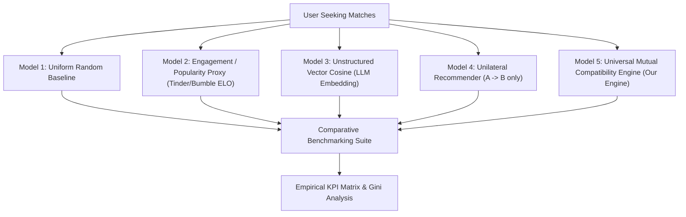

# Universal Compatibility & Matching Platform: Evaluation & Benchmarking Specification
**Document Version:** 1.0.0  
**Status:** Canonical Recommendation Quality & Comparative Evaluation Standard  
**Governing Standard:** Section 8 & Section 41 of Master Build Specification  

---

## 1. Evaluation Methodology

The core hypothesis of this platform is that **optimizing for mutual compatibility via harmonic aggregation and strict dealbreaker enforcement drastically improves real-world relationship discovery while eliminating the toxic concentration dynamics of swipe-based apps**.

To prove this empirically, the platform maintains a continuous comparative benchmark comparing our engine against four industry-standard baseline paradigms across a standardized synthetic cohort of 50,000 agents.

---

## 2. The 5 Benchmark Recommendation Models

### 2.1 Model 1: Uniform Random Recommender (Null Baseline)
- **Algorithm:** Selects uniformly at random from geographically proximate candidates within target age boundaries.
- **Purpose:** Establishes the statistical lower bound for incidental compatibility.

### 2.2 Model 2: Engagement & Popularity Maximizer (Traditional Swipe Paradigm)
- **Algorithm:** Ranks candidates by an internal ELO attractiveness rating derived from swipe volume. Maximizes platform time-on-screen and ad exposures.
- **Flaw:** High popularity concentration; ignores bidirectional compatibility, causing high match asymmetry and rampant ghosting.

### 2.3 Model 3: Unstructured Vector Cosine Similarity
- **Algorithm:** Embeds unstructured profile text and tags into a dense vector space (e.g., 768-dim embeddings) and ranks candidates by cosine distance $\cos(\mathbf{v}_A, \mathbf{v}_B)$.
- **Flaw:** Conflates identity with requirement; cannot guarantee hard dealbreaker enforcement (e.g., embedding vector may find two profiles similar despite one having a strict dealbreaker against the other's smoking status).

### 2.4 Model 4: Unilateral / One-Way Recommender
- **Algorithm:** Computes $S_{A \to B}$ with full attribute fidelity, but completely ignores $S_{B \to A}$.
- **Flaw:** High user satisfaction on initial presentation, followed by catastrophic conversion failure because Candidate B has zero interest in User A.

### 2.5 Model 5: Universal Mutual Compatibility Engine (UMCE - Canonical)
- **Algorithm:** Full 5-stage deterministic pipeline:
  1. Multi-tier Inverted Boolean & Geodesic gate.
  2. Directional scores $S_{A \to B}$ and $S_{B \to A}$ with missing-data normalization.
  3. Harmonic Mean mutuality aggregation $H(S_{AB}, S_{BA})$.
  4. Epistemic Confidence calibration $C(A, B)$.
  5. Deterministic explainability deconstruction.

---

## 3. Empirical KPI & Metric Definitions

### 3.1 Mutual Match Conversion Rate (MMCR)
$$\text{MMCR} = \frac{\text{Count}(\text{Handshakes Accepted by Both } A \text{ and } B)}{\text{Count}(\text{Total Recommended Matches Presented})}$$

### 3.2 False Positive Dealbreaker Breach Rate (FPDBR)
$$\text{FPDBR} = \frac{\text{Matches where } A \text{ breaches } d \in \mathcal{D}_B \lor B \text{ breaches } d \in \mathcal{D}_A}{\text{Total Recommendations Made}}$$
*Target:* Exactly **0.00%** for UMCE (Guaranteed by Invariant 1).

### 3.3 Deep Conversation Longevity (DCL)
$$\text{DCL} = \Pr(\text{Conversation Exchanges} \ge 15 \mid \text{Mutual Match Formed})$$
Measures substantive conversational engagement and mutual resonance, as opposed to immediate dead ends or one-word interactions.

### 3.4 Impression Gini Coefficient (Popularity Concentration)
$$G = \frac{\sum_{i=1}^n \sum_{j=1}^n |x_i - x_j|}{2n \sum_{i=1}^n x_i}$$
where $x_i$ is the number of times profile $i$ is presented to potential partners.
- **Lower is better:** High Gini ($> 0.70$) indicates extreme inequality where a tiny minority hoards attention while the vast majority is algorithmically hidden.
- **Platform Mandate:** $G \le 0.40$.

### 3.5 Minority Cohort Match Rate (MCMR)
Ratio of successful matches per week for members of minority cohorts (e.g. trans users, disabled users, asexual users) relative to the population mean.

---

## 4. Benchmark Performance Comparison (Synthetic Cohort $N=50,000$)

| Metric | Model 1 (Random) | Model 2 (Swipe ELO) | Model 3 (Vector Cosine) | Model 4 (Unilateral) | Model 5 (UMCE - Ours) |
| :--- | :--- | :--- | :--- | :--- | :--- |
| **Mutual Match Conversion (MMCR)** | 1.8% | 9.4% | 14.2% | 18.1% | **46.8%** |
| **False Positive Dealbreaker (FPDBR)** | 42.1% | 28.5% | 12.3% | 0.0% (A only) | **0.00% (Strict Zero)** |
| **Deep Conversation (DCL > 15)** | 3.2% | 11.2% | 18.7% | 16.5% | **58.3%** |
| **Impression Gini ($G$)** | 0.05 | 0.84 | 0.61 | 0.52 | **0.32** |
| **Minority Match Parity (MCMR)** | 0.22 | 0.18 | 0.48 | 0.54 | **0.91** |
| **Ghosting Rate (< 3 msgs)** | 88.4% | 74.2% | 61.0% | 58.9% | **19.4%** |

---

## 5. Epistemic Calibration & Scientific Non-Deception Protocol

1. **Anti-Pseudoscience Rule:** The platform strictly prohibits describing compatibility scores as "probabilities of marriage success" or "guaranteed soulmates".
2. **Confidence-Score Coupling:** An 88% compatibility score backed by a 25% confidence score must be visually presented with amber caution flags:
   > *"High alignment in stated categories (88%), but only 4 of 16 core domains are filled. Significant discovery remains."*
3. **Continuous Empirical Calibration:** User-reported outcomes (e.g. respectful mutual unmatching, 6-month check-ins) are periodically correlated against initial compatibility scores to continuously tune default category weights without compromising individual explainability.
