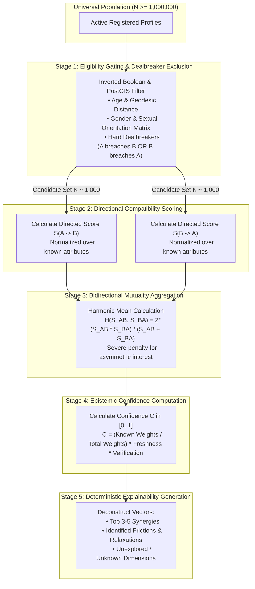

# Universal Compatibility & Matching Platform: Matching Specification
**Document Version:** 1.0.0  
**Status:** Canonical Algorithmic Standard  
**Governing Standard:** Section 5 & Section 41 of Master Build Specification  

---

## 1. Algorithmic Overview & Mathematical Pipeline

The Universal Compatibility & Matching Platform executes a 5-stage deterministic matching pipeline designed to guarantee **strict bidirectional mutuality, complete auditability, zero machine learning hallucination, and rigorous handling of epistemic uncertainty**.

---

## 2. Stage 1: Eligibility Gating & Dealbreaker Exclusion

Let Candidate $B$ be evaluated against User $A$. Stage 1 is a binary gating function $\mathcal{G}(A, B) \in \{0, 1\}$. If $\mathcal{G}(A, B) = 0$, Candidate $B$ is disqualified immediately:
$$S_{\text{mutual}}(A, B) = 0, \quad \text{isExcluded} = \text{true}$$

### 2.1 Spatial Eligibility
Let $\text{dist}_{\text{geo}}(A, B)$ denote the great-circle geodesic distance between $A$ and $B$.
$$\mathcal{G}_{\text{geo}}(A, B) = \begin{cases} 1 & \text{if } \text{dist}_{\text{geo}}(A, B) \le A.\text{max\_dist} + A.\text{flex\_dist} \;\land\; \text{dist}_{\text{geo}}(A, B) \le B.\text{max\_dist} + B.\text{flex\_dist} \\ 0 & \text{otherwise} \end{cases}$$

### 2.2 Sexual Orientation & Gender Identity Feasibility
Eligibility requires mutual orientation compatibility:
$$\mathcal{G}_{\text{orient}}(A, B) = \mathbb{I}(B.\text{gender} \in A.\text{sought\_genders}) \land \mathbb{I}(A.\text{gender} \in B.\text{sought\_genders})$$

### 2.3 Hard Dealbreaker Exclusion
Let $\mathcal{D}_A$ denote the set of hard exclusionary constraints defined by $A$, where each constraint $d \in \mathcal{D}_A$ specifies an attribute $k$ and an allowed set of values $\mathcal{V}_{d}$.
$$\mathcal{G}_{\text{dealbreaker}}(A, B) = \prod_{d \in \mathcal{D}_A} \mathbb{I}(B.\text{attr}_k \in \mathcal{V}_d) \times \prod_{d \in \mathcal{D}_B} \mathbb{I}(A.\text{attr}_k \in \mathcal{V}_d)$$
If any hard dealbreaker is breached by either party, the product evaluates to 0.

$$\mathcal{G}(A, B) = \mathcal{G}_{\text{geo}}(A, B) \times \mathcal{G}_{\text{orient}}(A, B) \times \mathcal{G}_{\text{dealbreaker}}(A, B)$$

---

## 3. Stage 2: Directional Compatibility Scoring

Directional compatibility represents how well Candidate $B$'s profile satisfies User $A$'s expressed preferences: $S_{A \to B} \in [0, 100]$.

### 3.1 Handling Epistemic Uncertainty (Missing Information Invariant)
**Constitutional Rule:** Missing or unpopulated information must NEVER be scored as 0 or treated as an incompatibility.

Let $\mathcal{A}$ be the universe of all matchable attributes. For a specific pairing $(A, B)$:
- $\mathcal{A}_{\text{eval}}$ is the subset of attributes where $A$ has specified a preference and $B$ has provided an attribute value.
- Attributes where $A$ expressed a preference but $B$'s value is `null` (or vice-versa) are omitted from the scoring denominator.

The active weight budget $W_{\text{active}}$ is:
$$W_{\text{active}}(A \to B) = \sum_{i \in \mathcal{A}_{\text{eval}}} w_{i, A}$$
where $w_{i, A} \in [1, 5]$ is User $A$'s subjective importance weight for attribute $i$.

### 3.2 Attribute-Level Scoring Functions $\sigma_i(A, B)$

#### 3.2.1 Categorical Exact / Matrix Matching
For categorical fields with compatibility matrices $\mathbf{M}$ (e.g., Relationship Intent, Communication Conflict Style):
$$\sigma_i(A, B) = \mathbf{M}[A.\text{pref}_i, B.\text{val}_i] \in [0.0, 1.0]$$

#### 3.2.2 Multi-Select Overlap (Values, Passions, Neurotypes)
Evaluated using the Weighted Jaccard Index or Szymkiewicz–Simpson overlap coefficient:
$$\sigma_i(A, B) = \frac{|A.\text{sought}_i \cap B.\text{values}_i|}{|A.\text{sought}_i|}$$

#### 3.2.3 Scalar Distance with Controlled Flexibility Relaxation
For scalar attributes (e.g., Age, Distance, Chronotype hour), let $\Delta_i = |A.\text{target}_i - B.\text{val}_i|$ and $\tau_i$ be $A$'s stated tolerance.
If $\Delta_i \le \tau_i$:
$$\sigma_i(A, B) = 1.0$$
If $\Delta_i > \tau_i$, with flexibility allowance $\Phi_i \ge 0$:
$$\text{excess} = \Delta_i - \tau_i$$
$$\sigma_i(A, B) = \max\left(0.1, 1.0 - \left(\frac{\text{excess}}{\Phi_i + 1}\right) \times 0.7\right)$$

### 3.3 Directional Aggregation
The total directional compatibility score $S_{A \to B}$ is:
$$S_{A \to B} = \frac{100}{W_{\text{active}}(A \to B)} \sum_{i \in \mathcal{A}_{\text{eval}}} w_{i, A} \cdot \sigma_i(A, B)$$
Similarly, $S_{B \to A}$ is computed from $B$'s perspective against $A$.

---

## 4. Stage 3: Bidirectional Mutuality Aggregation

Compatibility is fundamentally reciprocal. Arithmetic means ($\frac{S_{A \to B} + S_{B \to A}}{2}$) permit severe unilateral mismatches (e.g., $95\%$ and $20\%$ yielding an acceptable-looking $57.5\%$).

The platform mandates the **Harmonic Mean** $H(S_{A \to B}, S_{B \to A})$:

$$S_{\text{mutual}}(A, B) = \begin{cases} 0.0 & \text{if } S_{A \to B} = 0 \lor S_{B \to A} = 0 \\ \frac{2 \cdot S_{A \to B} \cdot S_{B \to A}}{S_{A \to B} + S_{B \to A}} & \text{otherwise} \end{cases}$$

### 4.1 Mathematical Properties of the Harmonic Aggregator
1. **Zero-Floor:** If either directed score is 0, the mutual score is strictly 0.
2. **Asymmetry Penalty:**
   - Case 1: $S_{A \to B} = 60\%, S_{B \to A} = 60\% \implies S_{\text{mutual}} = 60.0\%$
   - Case 2: $S_{A \to B} = 90\%, S_{B \to A} = 30\% \implies S_{\text{mutual}} = 45.0\%$  
   *(Notice that despite having the same arithmetic mean of 60%, Case 2 is penalized heavily because Person B's satisfaction is deficient).*
3. **Strict Symmetry:** $S_{\text{mutual}}(A, B) = S_{\text{mutual}}(B, A)$.

---

## 5. Stage 4: Epistemic Confidence Scoring

Confidence $C(A, B) \in [0.0, 1.0]$ measures the epistemic completeness and reliability of the data backing the compatibility calculation.

$$C(A, B) = \left( \frac{\sum_{i \in \mathcal{A}_{\text{eval}}} (w_{i, A} + w_{i, B})}{\sum_{j \in \mathcal{A}_{\text{all\_matchable}}} (w_{j, A} + w_{j, B})} \right) \times \gamma_{\text{verif}} \times \gamma_{\text{fresh}}$$

Where:
- $\gamma_{\text{verif}} \in [0.85, 1.0]$ reflects identity and photo verification state.
- $\gamma_{\text{fresh}} = \exp\left(-\frac{\Delta t_{\text{months}}}{24}\right)$ accounts for data freshness and profile staleness.

### 5.1 Presentation Separation
In all user interfaces and API responses, $S_{\text{mutual}}$ and $C(A, B)$ are displayed concurrently:
$$\text{e.g., "Mutual Compatibility: 88% (High Confidence: 92% of profile dimensions verified)"}$$
$$\text{vs. "Mutual Compatibility: 88% (Low Confidence: 34% of dimensions known - exploratory)"}$$

---

## 6. Stage 5: Deterministic Explainability & Tension Mapping

The system decomposes every match score into three inspectable vectors:

### 6.1 Top Synergies ($\mathcal{E}_{\text{pos}}$)
Attributes where:
$$\sigma_i(A, B) \ge 0.85 \quad \land \quad \sigma_i(B, A) \ge 0.85 \quad \land \quad (w_{i, A} + w_{i, B}) \ge 6$$
Ranked in descending order of cumulative weight contribution.

### 6.2 Identified Frictions & Tensions ($\mathcal{E}_{\text{neg}}$)
Attributes where:
$$\min(\sigma_i(A, B), \sigma_i(B, A)) \le 0.60 \quad \land \quad \mathcal{G}_{\text{dealbreaker}} = 1$$
Documents where preferences required flexibility relaxation (e.g., "Person A prefers morning routines; Person B is a night owl; fits within Person A's stated tolerance").

### 6.3 Epistemic Unknowns ($\mathcal{E}_{\text{unknown}}$)
High-impact categories (Weight $\ge 4$) unpopulated by one or both parties (e.g., "Family & Children intentions have not yet been specified by Candidate B").

---

## 7. Invariants & Proof Requirements

| Invariant ID | Rule Formulation | Verification Method |
| :--- | :--- | :--- |
| **INV-01** | $\mathcal{G}_{\text{dealbreaker}} = 0 \implies S_{\text{mutual}} = 0$ | Unit test with boundary breaches |
| **INV-02** | $\text{Score}(A, B)$ without attribute $k$ equals $\text{Score}(A, B)$ when $k = \text{null}$ | Invariant property test |
| **INV-03** | $S_{\text{mutual}}(A, B) \equiv S_{\text{mutual}}(B, A)$ for all valid profiles | Commutative unit test |
| **INV-04** | $C(A, B) \le 1.0 \land C(A, B) \ge 0.0$ | Boundary range verification |
| **INV-05** | No free-form generative LLM in explanation generation | Code inspection & deterministic audit |
