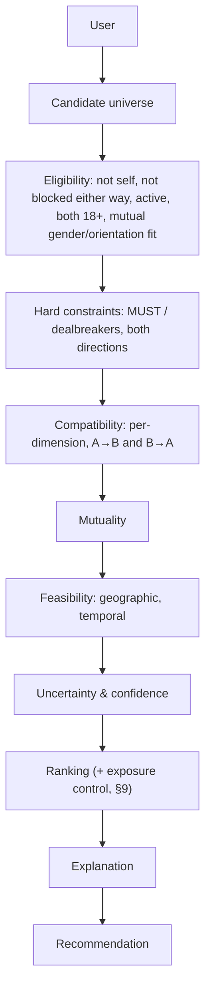

# MATCHING_SPEC.md

> **Status:** DRAFT v0.2 — not accepted. Formulas marked **[PROPOSED]** are candidates; they are
> not to be implemented as final until the linked open decision is resolved. Nothing here is a
> claim about real-world relationship outcomes.

## 1. Scope

Defines `evaluateMatch(userA, userB)` and the recommendation pipeline. Engine is deterministic,
pure (no I/O, no clock reads except an injected `now`), versioned (`ruleset_version`), and never
reads popularity, payment, or behavioural-engagement data.

## 2. Output contract (spec §7, §11)

```ts
type DimensionResult = {
  score: number | null        // 0–100, null = UNKNOWN (never 0 for unknown)
  status: 'KNOWN' | 'PARTIAL' | 'UNKNOWN'
  knownWeight: number
  statedWeight: number
  contributors: CriterionResult[]
}

type MatchEvaluation = {
  rulesetVersion: string
  eligible: boolean
  hardConflicts: HardConflict[]             // which gate, which direction (A→B / B→A)
  compatibility: { aToB: number | null; bToA: number | null }
  mutuality: { score: number | null; method: string; asymmetric: boolean; gap: number | null }
  attraction: DimensionResult               // six sub-types, spec §12
  preferenceAlignment: DimensionResult
  valueAlignment: DimensionResult
  lifestyleAlignment: DimensionResult
  relationshipAlignment: DimensionResult
  familyAlignment: DimensionResult
  communicationAlignment: DimensionResult   // spec §11 lists it; §7 omits it — included
  geographicFeasibility: DimensionResult
  temporalFeasibility: DimensionResult
  uncertainty: { unknownAttributes: UnknownItem[]; coverageAtoB: number; coverageBtoA: number }
  confidence: { score: number; label: 'LOW' | 'MEDIUM' | 'HIGH' }
  contradictions: PreferenceContradiction[] // spec §14 (inputs of A or B)
  explanation: Explanation                  // spec §15
}
```

If `eligible = false`, compatibility/mutuality are still computed for diagnostics but the pair is
**never recommended**, and no other score can override the gate (spec §8).

## 3. Pipeline (spec §16)



## 4. Hard constraints (spec §8)

A gate fires when **all** hold:
1. the attribute is `hard_constraint_capable`, and
2. the evaluator's preference has `requirement_level = MUST` **or** `dealbreaker = true`, and
3. the other person's value is **known and matchable**, and
4. the value violates the constraint.

Gates are evaluated in both directions. Any fired gate ⇒ `eligible = false`.

Spec example: A `wants_children` MUST ∈ {definitely}; B = `definitely not` ⇒ ineligible.
"Prefer children, but flexible" (`PREFERENCE`, flexibility > 0, no dealbreaker) ⇒ scored, never gated.

**[OPEN D-07] Unknown value on a MUST.** If A requires non-smoker and B's smoking is UNKNOWN (or
not matchable), rule 4 cannot be evaluated. Spec §9 says unknown ≠ incompatible, so the
proposal is: B stays eligible, the requirement is listed as *unconfirmed* in `uncertainty` and
the explanation, and confidence drops. Alternative: let users opt in to "hide people who haven't
answered". Requires a product decision.

## 5. Directional scoring

### 5.1 Criterion score
For each preference `p` of evaluator E against target T:

- `NEUTRAL` or no preference → not scored.
- T's value UNKNOWN or `matchable = false` → criterion = UNKNOWN; added to uncertainty; **excluded
  from both numerator and denominator**.
- otherwise `σ(p) ∈ [0, 1]` by value type:

| Value type | σ when match | σ when mismatch |
| :--- | :--- | :--- |
| single/multi select | 1 | `m(flex)` |
| ordinal | `1 − d / d_max` blended with `m(flex)` for d>0 | |
| range (age, height, distance) | 1 inside range | decays with distance outside range, floor `m(flex)` |
| AVOID | 1 if absent | `m(flex)` if present |

**[PROPOSED, OPEN D-09] Flexibility mapping.** Spec §13 gives flexibility 0–100 but no formula.
Candidate: `m(flex) = flex / 100 × 0.8` (flex 0 ⇒ 0; flex 100 ⇒ 0.8, never full credit for a
mismatch). The existing prototype instead uses `max(0.2, 1 − excess/(margin+1) × 0.7)` with
margins in years/miles — a different, unit-based model. One must be chosen.

### 5.2 Importance weights
`w(STRONG_PREFERENCE) = importance × 2`, `w(PREFERENCE) = importance`, `w(AVOID) = importance`.
**[PROPOSED, OPEN D-09]** — multiplier 2 is an assumption.

### 5.3 Dimension score
`D = 100 × Σ wσ / Σ w` over known criteria in that dimension; `null` (UNKNOWN) if no known criteria.
Status `PARTIAL` if some stated criteria were unknown.

### 5.4 Directional compatibility
`S(A→B)` = weighted mean of known dimension scores (dimension weights **[OPEN D-10]**; default
equal). `null` if every dimension is unknown — **never a default such as 75**.

## 6. Mutuality (spec §10)

All five methods required by the spec, evaluated on the spec example (95, 25):

| Method | Formula | (95, 25) | (60, 60) | Zero handling | Notes |
| :--- | :--- | :-: | :-: | :--- | :--- |
| Arithmetic mean | (a+b)/2 | 60.0 | 60 | 0 only if both 0 | Hides asymmetry — rejected as primary |
| Geometric mean | √(ab) | 48.7 | 60 | 0 if either 0 | Moderate asymmetry penalty |
| Harmonic mean | 2ab/(a+b) | 39.6 | 60 | 0 if either 0 | Stronger penalty; standard in reciprocal recommenders |
| Minimum | min(a,b) | 25.0 | 60 | 0 if either 0 | Strongest; ignores the higher side entirely |
| Weighted reciprocal | **definition ambiguous** | — | — | — | **[OPEN D-11]** spec does not define it; candidate: `λ·min + (1−λ)·mean` |

**Provisional selection: harmonic mean**, because it (a) is symmetric, (b) is 0 when either side
is 0, (c) penalises asymmetry more than the geometric mean while still rewarding the higher side,
unlike the minimum. **This is provisional until the Phase 5 / Phase 9 simulation compares all five
on synthetic data (EVALUATION.md).** The method name is returned in every result.

`asymmetric = |a − b| ≥ 30` **[PROPOSED threshold]**; asymmetric pairs are labelled as such in the
explanation and never described as a strong mutual match.

## 7. Uncertainty and confidence (spec §9, §11)

- `coverage(A→B) = Σ w(known) / Σ w(stated)` over A's stated preferences.
- **[PROPOSED]** `confidence = 100 × min(coverageAtoB, coverageBtoA) × v`, where `v = 1` if the
  attributes used are verified/consistent and `< 1` otherwise (exact factors **[OPEN D-12]**).
- Labels: LOW < 40 ≤ MEDIUM < 70 ≤ HIGH **[PROPOSED]**.
- Confidence never changes compatibility; compatibility never changes confidence.

## 8. Preference contradictions (spec §14)

Detected on the user's own inputs, never silently resolved. Output `PREFERENCE_CONTRADICTION`
with both conflicting inputs; the UI asks the user to resolve. Initial rule set:

| Code | Condition |
| :--- | :--- |
| `DISTANCE_NEUTRAL_BUT_LIMITED` | distance preference `NEUTRAL` but `max_distance_km` set |
| `MUST_WITH_FLEXIBILITY` | `MUST` with flexibility > 0 (pending D-02) |
| `MUST_AND_AVOID_SAME_VALUE` | same value required and avoided |
| `EMPTY_ACCEPTABLE_SET` | MUST allows no value at all |
| `SELF_EXCLUDING_RANGE` | min > max |
| `INTENT_STRUCTURE_CONFLICT` | e.g. seeks monogamy and states polyamorous structure for self (flag only; may be intentional) |

## 9. Ranking and popularity control (spec §16–17)

Ranking key: eligible only → mutuality (desc) → confidence (desc) → stable tie-break by hashed
pair id. Popularity (likes received, exposure) is **not** an engine input. A separate, documented
exposure-control re-ranker may cap repeated exposure of the same profiles; its mechanism is
**[OPEN D-13]** and must be evaluated, not assumed fair (spec §18).

## 10. Explanation (spec §15)

Deterministic templates keyed by attribute/dimension; no generative text.

```
WHY THIS MATCH?
Strong alignment:  dimensions with score ≥ 80 in both directions
Potential friction: criteria with σ < 0.5 that did not gate
Unknown:           highest-weight unknown criteria
Confidence:        LOW / MEDIUM / HIGH
```
Explanations must not reveal the other person's private preferences or non-displayed attributes
(e.g. state "a lifestyle preference differs", not "they require a non-smoker") — **[OPEN D-14]**
exact disclosure policy.

## 11. Invariants (spec §27) — each must have a property test

1. Changing a non-matchable attribute never changes any score.
2. Toggling `dealbreaker` false→true can only keep or remove eligibility, never add it.
3. Replacing a known value with UNKNOWN never makes the pair ineligible and never yields a 0 for that criterion.
4. Blocked users (either direction) are never recommended.
5. A user is never recommended to themselves.
6. An ineligible pair is never recommended.
7. Mutuality is symmetric: `M(A,B) = M(B,A)`.
8. Scores are bounded 0–100; confidence 0–100.
9. Determinism: same inputs + ruleset version ⇒ identical output.
10. Payment/subscription state never changes any score.
