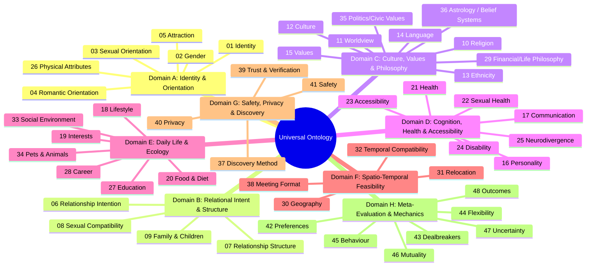

# Universal Compatibility & Matching Platform: Universal Matching Ontology (UMO)
**Document Version:** 0.2 (DRAFT — not accepted)  
**Governing Standard:** Section 3 of Master Build Specification  

> [!IMPORTANT]
> **Review notes (v0.2)**
> 1. The 48 categories are mandated by the spec. The **value lists inside each category are
>    illustrative drafts written by the agent**, not product requirements. Each list needs review
>    (ideally with people from the communities concerned) before Phase 1 — see ARCHITECTURE_REVIEW.md D-05.
> 2. Mermaid `mindmap` below renders on GitHub but not in every viewer.
> 3. Categories requiring explicit **policy decisions on discrimination risk** before they may be
>    `matchable` or `hard_constraint_capable` (spec §0.13, §40): 13 Ethnicity, 26 Physical attributes,
>    24 Disability, 25 Neurodivergence, 21 Health, 22 Sexual health, 10 Religion, 35 Politics,
>    02 Gender (as a preference target), 09 existing children. See ARCHITECTURE_REVIEW.md D-06.
> 4. Category 45 Behaviour, 46 Mutuality, 47 Uncertainty and 48 Outcomes are **system-derived**
>    categories; users do not fill them in.
> 5. Every attribute is optional unless ARCHITECTURE_REVIEW.md resolves otherwise (spec §6:
>    "Do not force users to complete every field").

### User model (spec §6)

```
USER
├── Identity                 (cat 01–05, 12–14, 24–26)
├── Relationship objective   (cat 06–07)
├── Preferences              (cat 42; one record per attribute)
├── Requirements             (requirement_level = MUST)
├── Dealbreakers             (cat 43; explicit flag)
├── Flexibility              (cat 44; 0–100 per preference)
├── Lifestyle                (cat 18, 20, 21, 33, 34)
├── Values                   (cat 10, 11, 15, 29, 35, 36)
├── Attraction preferences   (cat 05; six types below)
├── Accessibility            (cat 23)
├── Family plans             (cat 09)
├── Communication            (cat 17)
├── Geography                (cat 30–31)
├── Availability             (cat 32, 38)
├── Privacy controls         (cat 40)
├── Safety settings          (cat 41)
├── Verification             (cat 39)
└── Behavioural history      (cat 45; system-recorded)
```

### Attraction types (spec §12)

Physical · Emotional · Intellectual · Romantic · Sexual · Social. Attraction is never reduced to
physical appearance, and **no characteristic is ever inferred from images**. The aesthetic /
auditory / spiritual modes listed under Category 05 below are agent suggestions pending review.

---

## 1. Ontological Framework & Core Distinctions

In traditional dating platforms, human identity, lifestyle, constraints, and desires are collapsed into flat, unstructured strings or shallow tags. This causes catastrophic semantic ambiguity (e.g., confusing what someone *is* with what someone *requires* in a partner).

The Universal Compatibility & Matching Platform establishes **13 Fundamental Semantic Distinctions**:

```
[ IDENTITY ]      : Who a person is intrinsically (e.g., gender, orientation, culture, neurotype).
[ INTENTION ]     : The structural purpose of entering the relationship space (e.g., marriage, casual discovery).
[ REQUIREMENT ]   : An absolute, non-negotiable condition for eligibility (breach = immediate candidate exclusion).
[ PREFERENCE ]    : A weighted desire along a continuum (breach = partial credit penalty based on weight).
[ DEALBREAKER ]   : An explicit exclusion criterion defined by a user (e.g., "Must not smoke", "Must want kids").
[ FLEXIBILITY ]   : The acceptable variance or decay threshold around a stated preference.
[ ATTRACTION ]    : Multi-modal preferences for physical, intellectual, emotional, or sensory alignment.
[ COMPATIBILITY ] : The mathematical alignment between one person's criteria and another's reality.
[ MUTUALITY ]     : The bidirectional balance of satisfaction ($A \to B$ vs $B \to A$), aggregated symmetrically.
[ FEASIBILITY ]   : Physical, geographic, legal, or temporal viability of co-existence.
[ UNCERTAINTY ]   : The epistemic unknown; absence of information, treated separately from incompatibility.
[ BEHAVIOUR ]     : Observed communicative pacing, response latency, and reliability signals.
[ OUTCOME ]       : The empirical downstream trajectory of a match (e.g., long-term union, respectful parting).
```

---

## 2. The 48 Ontological Categories

The platform organizes human compatibility across 48 distinct categories structured into 8 functional domains:



---

### Domain A: Identity, Orientation & Attraction

#### Category 01: IDENTITY
- **Definition:** The fundamental self-concept, autonomous individuality, and holistic existential context of the user.
- **Attributes:** `pronouns` (she/her, he/him, they/them, custom, neopronouns), `public_bio`, `verification_badge_level`.

#### Category 02: GENDER
- **Definition:** User's gender identity and expression.
- **Attributes:** `gender_identity` (Cis Woman, Cis Man, Trans Woman, Trans Man, Non-Binary, Genderfluid, Agender, Two-Spirit, Intersex, Self-Described), `gender_presentation` (Feminine, Masculine, Androgynous, Fluid).
- **Matching Role:** Filter and preference dimension. Protected characteristic.

#### Category 03: SEXUAL ORIENTATION
- **Definition:** The patterns of sexual attraction experienced by the individual.
- **Attributes:** `orientation` (Heterosexual, Homosexual/Gay/Lesbian, Bisexual, Pansexual, Asexual, Demisexual, Graysexual, Queer, Questioning).
- **Matching Role:** Core eligibility gating factor.

#### Category 04: ROMANTIC ORIENTATION
- **Definition:** Patterns of romantic or emotional attraction, distinguished explicitly from sexual orientation.
- **Attributes:** `romantic_orientation` (Alloromantic, Aromantic, Biromantic, Panromantic, Demiromantic, Homoromantic, Heteroromantic).

#### Category 05: ATTRACTION
- **Definition:** Multi-modal attraction profiles (intellectual, emotional, aesthetic, kinetic, voice/sensory).
- **Attributes:** `attraction_modes` (multi-select: Intellectual/Sapiosexual, Emotional/Demisexual, Aesthetic, Physical, Sensory/Auditory, Energetic/Spiritual).

#### Category 26: PHYSICAL ATTRIBUTES
- **Definition:** Observable somatic attributes voluntarily declared by user.
- **Attributes:** `height_cm` (scalar), `body_type` (self-selected), `aesthetic_presentation`.
- **Constraint Support:** Supports soft preference and scalar distance decay; strictly forbidden from systemic algorithmic rank-down.

---

### Domain B: Relational Intent & Structure

#### Category 06: RELATIONSHIP INTENTION
- **Definition:** The temporal and emotional horizon desired by the user.
- **Allowed Values:** `Long-Term Partnership / Marriage`, `Long-Term Exploratory`, `Short-Term Dating`, `Casual Companionship`, `Life Partner (Non-Romantic/Platonic)`, `Shared Domesticity`, `Undecided / Intentional Discovery`.
- **Matching Rule:** Categorical matrix. Incompatible intentions (e.g. Long-term Monogamous Marriage vs. Casual Only) trigger hard exclusion if designated as a Dealbreaker.

#### Category 07: RELATIONSHIP STRUCTURE
- **Definition:** The relational architecture and boundary agreements governing partnerships.
- **Allowed Values:** `Strictly Monogamous`, `Monogamish`, `Ethically Non-Monogamous (ENM)`, `Polyamorous (Hierarchical)`, `Polyamorous (Non-Hierarchical / Relationship Anarchy)`, `Open Relationship`, `Solo Polyamory`, `Poly-Curious / Flexible`.
- **Matching Rule:** High-weight gating factor. Structural mismatch (Monogamy vs. Polyamory) acts as an automatic critical friction point.

#### Category 08: SEXUAL COMPATIBILITY
- **Definition:** Intimacy dynamics, desire levels, and communicative openness regarding sex.
- **Attributes:** `libido_rhythm` (High, Moderate, Low, Context-Dependent, Non-Sexual), `kink_bdsm_alignment` (Vanilla, Curious, Experienced Practitioner, Lifestyle / 24-7), `sensory_preferences`.
- **Privacy Level:** Tier 3 (Match-Only / Mutual Permission).

#### Category 09: FAMILY & CHILDREN
- **Definition:** Past, present, and future stance on parenthood and childcare.
- **Attributes:** 
  - `has_children` (Yes - custodial, Yes - shared, Yes - grown, No).
  - `wants_children` (Definite Yes, Open/Leaning Yes, Not Sure, Leaning No, Definite Never/Childfree).
- **Matching Rule:** Primary source of Dealbreakers. "Definite Yes" vs. "Childfree Never" constitutes an irreconcilable hard conflict when either user marks it as a dealbreaker.

---

### Domain C: Culture, Values & Philosophy

#### Category 10: RELIGION & SPIRITUALITY
- **Definition:** Faith traditions, spiritual practices, and theological views.
- **Allowed Values:** `Atheist`, `Agnostic`, `Christian (Protestant)`, `Christian (Catholic)`, `Christian (Orthodox)`, `Jewish (Reform/Conservative/Orthodox)`, `Muslim (Sunni/Shia)`, `Hindu`, `Buddhist`, `Sikh`, `Spiritual but not Religious`, `Pagan / Earth-Based`, `Interfaith / Eclectic`.
- **Sub-attribute:** `practice_intensity` (Scalar 1–5: Cultural only $\to$ Daily observant).

#### Category 11: WORLDVIEW & EPISTEMOLOGY
- **Definition:** Philosophical approaches to existence, truth, and society.
- **Attributes:** `worldview_framework` (Scientific Rationalism, Existential Humanism, Traditionalist, Post-Modern / Relativist, Spiritual-Holistic, Stoic, Pragmatist).

#### Category 12: CULTURE & TRADITION
- **Definition:** Heritage, cultural background, and attachment to heritage traditions.
- **Attributes:** `cultural_background` (multi-select), `heritage_importance` (1–5 scale).

#### Category 13: ETHNICITY
- **Definition:** Self-identified ethnic identity.
- **Matching Rule:** Strictly self-declared. Prohibited from algorithmic suppression; user preferences for cultural preservation/shared heritage are user-driven options only.

#### Category 14: LANGUAGE
- **Definition:** Spoken, written, and sign languages with fluency proficiency.
- **Attributes:** `languages` (Array of objects: `{ code: ISO-639-1, proficiency: native | fluent | conversational | learning }`).
- **Matching Rule:** Feasibility gate. At least one overlapping shared language (conversational+) is required for communicative viability unless explicitly relaxed.

#### Category 15: VALUES
- **Definition:** Core guiding moral and life principles.
- **Attributes:** Ranked vector across: `Integrity`, `Kindness`, `Autonomy`, `Growth/Self-Actualization`, `Family`, `Community`, `Security`, `Creativity`, `Justice`, `Curiosity`, `Loyalty`.
- **Scoring:** Cosine distance and Spearman's rank correlation coefficient.

#### Category 29: FINANCIAL & LIFE PHILOSOPHY
- **Definition:** Approaches to wealth, consumption, security, and material life.
- **Attributes:** `spending_style` (Frugal / Saver, Balanced Value-Seeker, Experiential Spender, High Consumption), `financial_transparency` (Joint accounts, Separate accounts, Hybrid), `career_centrality` (Work is identity vs. Work funds life).

#### Category 35: POLITICS & CIVIC VALUES
- **Definition:** Political orientation, social justice perspectives, and civic engagement.
- **Attributes:** `political_orientation` (Progressive / Left, Liberal / Moderate Left, Centrist / Independent, Libertarian, Conservative / Right, Apolitical / Disillusioned, Democratic Socialist, Anarchist), `activism_importance` (1–5).

#### Category 36: ASTROLOGY & USER-SELECTED BELIEF SYSTEMS
- **Definition:** Astrological charts, Enneagram, Myers-Briggs, Human Design, or personal esoteric systems.
- **Platform Invariant:** Opt-in only. Never computed or inferred by default. Never presented as scientific compatibility.

---

### Domain D: Cognition, Health & Accessibility

#### Category 16: PERSONALITY
- **Definition:** Validated psychological constructs (Big Five / OCEAN continuum).
- **Attributes:** `openness` (0–100), `conscientiousness` (0–100), `extraversion` (0–100), `agreeableness` (0–100), `neuroticism_emotional_stability` (0–100).
- **Scoring:** Evidence-based complementary/congruence models (e.g., high agreeableness congruence, complementary extraversion/introversion).

#### Category 17: COMMUNICATION
- **Definition:** Conflict resolution methods, emotional expression, and contact cadence.
- **Attributes:**
  - `conflict_style` (Direct / Immediate Resolver, Collaborative / Reflective, Space-Needing / Cool-Off, Conflict-Avoidant).
  - `digital_cadence` (Frequent texting throughout day, End-of-day check-in, Low digital / In-person focus).
  - `love_languages` (Words of Affirmation, Quality Time, Receiving Gifts, Acts of Service, Physical Touch).

#### Category 21: HEALTH & WELLBEING
- **Definition:** Physical habits, sleep hygiene, and holistic wellness routines.
- **Attributes:** `sleep_chronotype` (Early Bird / Morning Lark, Intermediate, Night Owl), `exercise_frequency` (Daily, Several times/week, Occasional, Sedentary).

#### Category 22: SEXUAL HEALTH
- **Definition:** Voluntary health disclosures (STI screening cadence, barrier expectations).
- **Privacy Level:** Tier 4 (Highest Encryption). Displayed only under reciprocal consent.

#### Category 23: ACCESSIBILITY
- **Definition:** Environmental, sensory, and physical accessibility requirements.
- **Attributes:** `step_free_access_required` (boolean), `sensory_friendly_required` (boolean), `asl_sign_language` (boolean), `service_animal_presence` (boolean).

#### Category 24: DISABILITY
- **Definition:** Physical, chronic illness, visual, auditory, or mobility disabilities.
- **Platform Invariant:** Strict affirmative dignity protection. No punitive scoring. Facilitates shared mutual understanding and accessibility accommodation.

#### Category 25: NEURODIVERGENCE
- **Definition:** Neurological variations including ADHD, Autism, AuDHD, Tourette's, Dyspraxia, Giftedness, etc.
- **Attributes:** `neurotypes` (multi-select: Neurotypical, Autistic, ADHD, AuDHD, Sensory Sensitive, etc.), `communication_preferences` (e.g., Unambiguous direct speech, parallel play / body doubling, sensory pacing).

---

### Domain E: Daily Life & Ecology

#### Category 18: LIFESTYLE & SUBSTANCES
- **Definition:** Daily substance habits and domestic rhythm.
- **Attributes:**
  - `smoking_tobacco` (Never, Socially, Regularly, Quitting).
  - `alcohol_consumption` (Non-Drinker / Sober, Occasional / Social, Moderate, Frequent).
  - `cannabis_use` (Never, Socially, Medically, Regularly).
  - `cleanliness_clean_order` (1–5: High minimalism/order $\to$ Casual clutter-tolerant).

#### Category 19: INTERESTS & PASSIONS
- **Definition:** Hobbies, creative pursuits, intellectual passions, and sports.
- **Attributes:** Hierarchical tag taxonomy (e.g., `Outdoors > Mountaineering`, `Arts > Modular Synthesis`, `Literature > Post-Modern Fiction`).
- **Scoring:** Jaccard overlap combined with cross-category semantic similarity.

#### Category 20: FOOD & DIET
- **Definition:** Dietary practices, culinary philosophy, and domestic food sharing.
- **Attributes:** `dietary_regime` (Omnivore, Vegetarian, Vegan, Pescatarian, Kosher, Halal, Gluten-Free / Celiac, Keto), `food_shared_table_importance` (1–5).

#### Category 27: EDUCATION
- **Definition:** Intellectual path and formal/informal educational background.
- **Attributes:** `formal_education_level` (High School, Trade/Vocational, Bachelor's, Master's, Doctorate/PhD, Self-Taught).

#### Category 28: CAREER & INDUSTRY
- **Definition:** Professional endeavor and daily vocations.
- **Attributes:** `industry_sector`, `work_modality` (Remote, Hybrid, On-Site, Nomadic), `work_hours_intensity` (Standard 40h, Flexible, High Demand / Entrepreneurial).

#### Category 33: SOCIAL ENVIRONMENT & FRIENDSHIPS
- **Definition:** Friend group dynamics, party size comfort, and social energy.
- **Attributes:** `social_battery_capacity` (Introverted homebody, Selective small groups, Extroverted community hub), `partner_integration` (Desire partner integrated into friend circle vs. Independent social lives).

#### Category 34: PETS & ANIMALS
- **Definition:** Companion animal relationships and allergies.
- **Attributes:** `has_pets` (Dogs, Cats, Birds, Reptiles, Small Animals, None), `pet_allergies` (Severe Cat, Severe Dog, etc.), `attitude_to_pets` (Animal lover / Pets on bed, Tolerant, Prefer pet-free home).

---

### Domain F: Spatio-Temporal Feasibility

#### Category 30: GEOGRAPHY & DISTANCE
- **Definition:** Physical location coordinates, geographic region, and travel radius.
- **Attributes:** `latitude`, `longitude` (fuzzed for privacy), `max_distance_km` (scalar), `distance_flexibility_km`.
- **Scoring:** Soft sigmoid decay beyond max distance if flexibility allowed; strict binary drop if hard dealbreaker.

#### Category 31: RELOCATION & MOBILITY
- **Definition:** Willingness to move, long-distance openness, and nomadism.
- **Attributes:** `relocation_willingness` (Never / Rooted, Open for right partner, Actively planning move, Digital Nomad), `long_distance_openness` (Never, Temporary with end date, Fully open).

#### Category 32: TEMPORAL COMPATIBILITY
- **Definition:** Time-zone alignment, work-shift schedules, and weekly free time.
- **Attributes:** `work_schedule` (Standard 9–5, Shift Work / Rotating, Night Shift, Irregular / Freelance), `shared_free_time_overlap` (Hours/week estimated overlap).

#### Category 38: MEETING FORMAT
- **Definition:** Preferred discovery progression from digital to in-person.
- **Attributes:** `first_meeting_preference` (Direct quick coffee, Extensive text chat first, Video call verification first, Activity/hobby based).

---

### Domain G: Safety, Privacy & Discovery

#### Category 37: DISCOVERY METHOD
- **Definition:** Algorithmic curation mode preferred by user.
- **Options:** `Mutual Compatibility Focus (High-Fit Batch)`, `Serendipity / Adjacent Discovery`, `Community / Shared Affinity Hubs`.

#### Category 39: TRUST & VERIFICATION
- **Definition:** Verification tiers for identity, photograph authenticity, and background safety.
- **Attributes:** `photo_verified` (boolean), `id_verified` (boolean), `social_proof_endorsements` (count).

#### Category 40: PRIVACY
- **Definition:** Granular controls over profile visibility and data use.
- **Model:** default `privacy_level` per attribute (`private`, `matches_only`, `members`, `public`) plus six independent per-user permissions (store, display, searchable, matchable, private, verified) — see ATTRIBUTE_DICTIONARY §4. Encryption approach is an open decision (D-08).

#### Category 41: SAFETY
- **Definition:** Safety guardrails, blocklists, location coarsening, and safety check-ins.
- **Attributes (draft):** `incognito_mode_active`, `safety_contact_enabled`. Location coarsening parameters are pending SECURITY_SPEC.

---

### Domain H: Meta-Evaluation & Mechanics

#### Category 42: PREFERENCES
- **Definition:** Stated desires about a partner's attribute, each with `requirement_level`, `importance` (1–5), `flexibility` (0–100), `dealbreaker`, `privacy_setting`.

#### Category 43: DEALBREAKERS
- **Definition:** Explicit exclusion flags. A violated dealbreaker on a known, matchable value (in either direction) makes the pair ineligible (MATCHING_SPEC §4). Unknown values do not trigger it (open decision D-07).

#### Category 44: FLEXIBILITY
- **Definition:** Willingness to compromise on a preference, 0–100. Mapping to scores is open decision D-09.

#### Category 45: BEHAVIOUR
- **Definition:** Observed in-product actions (system-recorded events). Not used as a matching input in the MVP; no hidden punitive ranking.

#### Category 46: MUTUALITY
- **Definition:** Aggregation of A→B and B→A compatibility. Five methods are compared; harmonic mean is provisional (MATCHING_SPEC §6).

#### Category 47: UNCERTAINTY
- **Definition:** What is unknown or unverified for a pair; reported separately and drives the confidence score (0–100), never the compatibility score.

#### Category 48: OUTCOMES
- **Definition:** Downstream signals (conversation, date, second date, feedback) collected for evaluation; never shown to users as a probability of relationship success.
