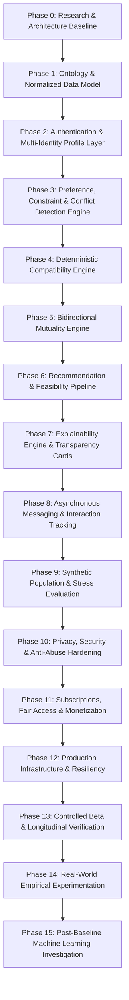

# PROJECT.md: Universal Compatibility & Relationship-Discovery Platform

## 1. Executive Summary & Mission

The **Universal Compatibility & Relationship-Discovery Platform** is an auditable, privacy-conscious, explainable, and reciprocal matching system designed to represent the broadest practical range of human relationship preferences, identities, constraints, lifestyles, values, attraction patterns, accessibility requirements, relationship structures, and behavioural outcomes.

This product is fundamentally **not** an engagement-loop dating app. Conventional platforms maximize metrics like Daily Active Users (DAU), swipes, ad impressions, and subscription upgrades by trapping users in continuous search feedback loops and promoting popularity cascades. In contrast, this platform optimizes strictly for:

$$\textbf{Optimization Objective: Mutual Compatibility & Sustainable Relationship Alignment}$$
$$\text{Subject to: Zero-Tolerance Hard Constraint Invariants and Complete Privacy Preservations}$$

---

## 2. Core Distinctions (Ontological Separation)

A foundational architectural requirement is that concepts describing human interaction must **never** be collapsed into generic profile fields or monolithic embeddings. The system enforces strict boundaries between:

| Concept | Definition | System Handling |
| :--- | :--- | :--- |
| **IDENTITY** | What an individual is (gender, orientation, neurotype, cultural origin). | Self-asserted; protected; never inferred from media or secondary signals. |
| **INTENTION** | What an individual is currently seeking (long-term partnership, marriage, casual dating, platonic co-parenting). | Primary filter; mutually evaluated. |
| **REQUIREMENT** | Non-negotiable condition (e.g., non-smoker, shared religion, non-monogamy consent). | Gating condition; violation triggers candidate exclusion. |
| **PREFERENCE** | Desired traits with varying degrees of importance (e.g., shared hobbies, education level). | Weighted scoring tier (Strong vs. Normal). |
| **DEALBREAKER** | Explicit rejection rule across specific attribute dimensions. | Hard binary boundary. |
| **FLEXIBILITY** | Quantifiable tolerance window for controlled relaxation around preferences. | Evaluated via continuous decay curves without binary dropoff. |
| **ATTRACTION** | Multi-faceted resonance (physical, emotional, intellectual, romantic, sexual, aesthetic). | Multi-dimensional matrix; never reduced to photo ranking. |
| **COMPATIBILITY** | Objective overlap and synergy of known attributes between two entities. | Computed over known domains only; missing data does not penalize score. |
| **MUTUALITY** | Bidirectional satisfaction: evaluates $A \to B$ AND $B \to A$. | Calculated via Harmonic Mean $H(S_{AB}, S_{BA})$ to penalize asymmetry. |
| **FEASIBILITY** | Practical viability (geographic proximity, time zone overlap, relocation ability). | Independent feasibility dimension. |
| **UNCERTAINTY** | Measure of unknown or unverified information mass. | Direct inverse driver of Confidence Score. |
| **BEHAVIOUR** | Verifiable in-app interactions (responsiveness, flake rate, conversation depth). | Used only for calibration and anti-abuse, never popularity boosting. |
| **OUTCOME** | Real-world trajectory (second date, partnership longevity, user feedback). | Longitudinal ground truth for future scientific evaluation. |

---

## 3. Absolute Development Rules (Constitutional Invariants)

1. **Phase-Gated Development**: Never build downstream features without upstream architectural baselines.
2. **No Invented Requirements**: All specifications must trace directly to formal requirements.
3. **No Silent Relaxations**: Hard constraints must never be loosened in code to artificially inflate match density.
4. **Ambiguity Stop Condition**: If matching mathematics or requirements are ambiguous, execution stops immediately until clarified.
5. **Deterministic Baseline First**: The core matching engine must be fully deterministic, auditable, and unit-tested before introducing statistical or machine learning layers.
6. **No Machine Learning in Core MVP**: Heuristic, rule-based, and multi-tier deterministic scoring must be rigorously baselined first.
7. **No Inferred Sensitive Data**: Race, religion, sexual orientation, disability, and health status must never be inferred by computer vision, text embeddings, or heuristic proxy.
8. **Unknown $\neq$ Incompatible**: Missing data reduces the **Confidence Score**; it never lowers the **Compatibility Score**.
9. **No Fabricated Certainty**: Compatibility percentages must never be presented as "probability of marriage/success" without empirical longitudinal proof.
10. **Privacy & Security by Design**: Separation of disclosure, searchability, display, and matchability across all sensitive properties.

---

## 4. Phase-by-Phase Roadmap

- **Phase 0 (Current)**: Architectural Specification, Ontology Formalization, Attribute Dictionary, Data Modeling, Security/Privacy Specs, Test & Evaluation Frameworks.
- **Phase 1**: Normalized Relational Schema implementation, JSON Schema validation, and migration scripts.
- **Phase 2**: Identity and Profile microservices with granular privacy levels.
- **Phase 3**: Preference hierarchy parsing, dealbreaker extraction, and contradiction detection.
- **Phase 4**: Pure deterministic compatibility scoring with strict unknown neutrality.
- **Phase 5**: Mutuality formulation (Harmonic Mean, geometric alternatives, asymmetry penalty).
- **Phase 6**: Candidate generation pipeline with popularity dampening and eligibility gating.
- **Phase 7**: Explainable match cards detailing positive drivers, friction points, and unknown factors.
- **Phase 8**: Interaction telemetry (conversation initiation, continuation, unmatch analysis).
- **Phase 9**: Synthetic user generator (up to $1,000,000$ synthetic profiles) for invariant and edge-case testing.
- **Phase 10**: Biometric selfie verification, rate limiting, and zero-knowledge encryption for sensitive attributes.
- **Phase 11**: Monetization decoupled from core matching logic (no pay-to-win exposure algorithms).
- **Phase 12–15**: Beta rollout, longitudinal outcome tracking, and benchmarked ML research against the deterministic baseline.

---

## 5. Engineering Roles & Responsibilities

- **System Architect**: End-to-end component decomposition, latency budgeting, and API contracts.
- **Data Architect**: Relational schema normalization, database partitioning, and migration safety.
- **Matching Systems Engineer**: Mathematical formalization of eligibility, mutuality, and relaxation functions.
- **QA & Verification Engineer**: Property-based invariant testing, edge-case generation, and regression coverage.
- **Security & Privacy Engineer**: Threat modeling (STRIDE), cryptographic key isolation, GDPR/CCPA enforcement, and location fuzzing.
- **UX & Transparency Architect**: Progressive disclosure flows, explainable match cards, and preference optimization visualizers.
