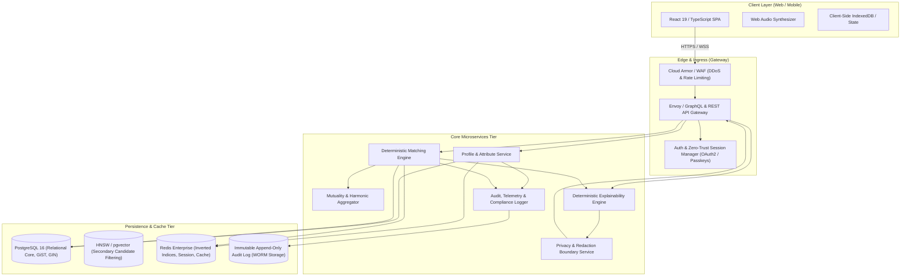
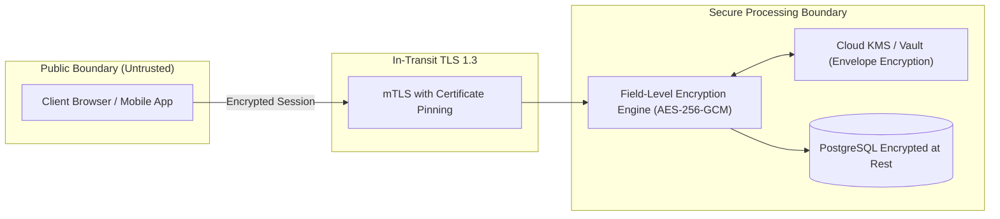

# Universal Compatibility & Matching Platform: System Architecture Specification
**Document Version:** 1.0.0  
**Status:** Architecture Baseline Accepted for Phase 0  
**Architect:** Principal System Architect & Core Platform Team  

---

## 1. Architectural Philosophy & Guiding Principles

The Universal Compatibility & Matching Platform is architected to optimize exclusively for **Mutual Compatibility, Authenticity, and Safety**, fundamentally rejecting engagement-loop maximization, popularity centralization, and gamified swipe-mechanics. 

### 1.1 Non-Negotiable Architectural Tenets
1. **Deterministic Core Before Probabilistic Inference:** The primary matching engine is 100% deterministic, explainable, and inspectable. No "black-box" machine learning is permitted in the candidate eligibility or scoring path during the baseline MVP phase.
2. **Bidirectional Mutuality ($A \leftrightarrow B$):** Matching is strictly symmetric in outcome evaluation. A candidate who satisfies Person A perfectly but for whom Person A breaches a dealbreaker is assigned an overall Mutual Compatibility Score of zero ($S_{\text{mutual}} = 0$).
3. **Decoupled Compatibility & Epistemic Confidence:** A high compatibility score computed on scarce data is fundamentally different from a high compatibility score computed on comprehensive data. Compatibility ($S$) and Confidence ($C$) are computed independently and presented side-by-side.
4. **Epistemic Incompleteness $\neq$ Rejection:** Missing data reflects unasked or unshared dimensions, never incompatibility. Unpopulated attributes are excluded from the normalization denominator.
5. **Zero-Knowledge Privacy Boundaries:** Sensitive identity attributes (e.g., neurodivergence details, STI status, discreet preferences, precise geolocation) are protected with multi-tier disclosure boundaries, client-side differential privacy, and homomorphic or zero-knowledge proof verification where applicable.

---

## 2. High-Level System Topology

---

## 3. Subsystem Decomposition & Component Responsibilities

### 3.1 Ingestion & Profile Management Service
- **Role:** Handles profile intake, multi-attribute self-identification, preference capture, and dealbreaker designation.
- **Validation Pipeline:** Enforces categorical domain boundaries, sanitizes free text (avoiding injection or PII leakage into non-PII fields), and validates range constraints (e.g., age ranges, geographic radii).
- **Privacy Masking:** Enforces column-level security and field-level encryption (FLE) for tier-4 sensitive fields before persistence.

### 3.2 Candidate Retrieval & Inverted Index Filter (Stage 1 Gate)
- **Role:** Reduces an active candidate space of $N \ge 1,000,000$ profiles down to a high-probability evaluation set of $K \approx 1,000$ within $< 25\text{ms}$.
- **Mechanisms:**
  - **Inverted Boolean Index (Redis / PostgreSQL GIN):** Fast bitwise intersection of universal hard constraints (Gender preference $\cap$ Sexual Orientation compatibility $\cap$ Age bracket $\cap$ Geography radius).
  - **Spatial Filtering:** PostGIS GiST index using geodesic spatial queries (`ST_DWithin`) ensuring spherical distance limits are strictly adhered to.
  - **Hard Dealbreaker Bitmask:** Each user profile encodes categorical dealbreakers into sparse bitmasks. Candidate retrieval executes fast bitwise AND operations (`(user_dealbreakers & candidate_attributes) == 0`).

### 3.3 Directional Matching Engine (Stage 2 Evaluator)
- **Role:** Evaluates directed satisfaction:
  1. $S_{A \to B}$: How well Candidate B satisfies Person A's criteria.
  2. $S_{B \to A}$: How well Candidate A satisfies Person B's criteria.
- **Processing Unit:** Deterministic mathematical scoring across 48 ontological categories. Evaluates:
  - Exact categorical matches.
  - Set-overlap coefficients (Jaccard / Szymkiewicz–Simpson for multi-select interests/values).
  - Scalar metric distance functions (exponential and linear decay curves with flexibility tolerances).
  - Complementary pairing matrices (e.g., introvert/extrovert synergy, communication styles).

### 3.4 Mutuality & Harmonic Mean Aggregator (Stage 3 Aggregator)
- **Role:** Synthesizes directed scores $S_{A \to B}$ and $S_{B \to A}$ into an integrated Mutual Compatibility Score $S_{\text{mutual}}$.
- **Mathematical Invariant:** Employs the **Harmonic Mean**:
  $$S_{\text{mutual}} = \begin{cases} 0 & \text{if } S_{A \to B} = 0 \text{ or } S_{B \to A} = 0 \\ \frac{2 \cdot S_{A \to B} \cdot S_{B \to A}}{S_{A \to B} + S_{B \to A}} & \text{otherwise} \end{cases}$$
- **Behavior:** Severely penalizes asymmetry. If $S_{A \to B} = 95\%$ but $S_{B \to A} = 15\%$, the harmonic mean collapses to $25.9\%$, preventing false-positive recommendations where one party is enthusiastic while the other would be alienated.

### 3.5 Deterministic Explainability & Friction Engine
- **Role:** Generates human-understandable, audit-verifiable explanations for every match recommendation without using generative hallucination.
- **Decomposition:**
  1. **Top Synergies:** The top 3–5 highest contributing positive score vectors (e.g., "Shared high valuation of intellectual curiosity and identical weekend rhythm").
  2. **Identified Frictions:** The top 1–3 non-fatal divergent attributes where flexibility was relaxed (e.g., "Differing sleep schedules: Night owl vs. Morning lark (within Person A's stated tolerance)").
  3. **Epistemic Unknowns:** Significant categories where one or both parties have not provided data, informing users where mutual discovery is still required.

### 3.6 Privacy & Redaction Boundary Service
- **Role:** Guarantees that sensitive attributes used internally for matching filtering (e.g., HIV/STI status, discrete neurodivergent accommodations, domestic boundaries) are NEVER leaked in API payloads or match explanations unless explicit mutual disclosure permissions are satisfied.

### 3.7 Web Audio Feedback Subsystem (Client-Side)
- **Role:** Provides accessible, organic acoustic telemetry for interface actions (swiping, drawer opening, match confirmation, error notification) without reliance on external asset loading.
- **Implementation:** Pure Web Audio API synthesizers (Polyphonic Sine/Triangle oscillator graphs, low-pass biquad filters, ADSR envelope generators) built directly into the client bundle.

---

## 4. Latency & Resource Budgets

| Pipeline Stage | Target Latency (p50) | Target Latency (p95) | Target Latency (p99) | Resource Constraint |
| :--- | :--- | :--- | :--- | :--- |
| **Ingress & Authentication** | 5 ms | 15 ms | 30 ms | Zero-copy JWT validation |
| **Stage 1: Hard Index Filtering** | 12 ms | 35 ms | 60 ms | In-memory Redis bitset / PostGIS |
| **Stage 2: Directional Scoring ($K=1000$)**| 35 ms | 85 ms | 140 ms | Multi-threaded CPU SIMD / Vectorized |
| **Stage 3: Mutuality & Harmonic Aggregation**| 5 ms | 12 ms | 25 ms | Linear complexity |
| **Stage 4: Confidence & Explainability** | 8 ms | 20 ms | 35 ms | Deterministic template evaluation |
| **Privacy Redaction & Serialization** | 3 ms | 8 ms | 15 ms | JSON streaming serializer |
| **Total End-to-End Pipeline** | **68 ms** | **175 ms** | **305 ms** | **Strict SLA: < 200 ms at p95** |

---

## 5. Security & Cryptographic Boundaries

1. **Envelope Encryption:** User PII and Tier-4 sensitive medical/identity attributes are encrypted with unique Data Encryption Keys (DEKs) per tenant/user, wrapped with Key Encryption Keys (KEKs) managed in Cloud HSM.
2. **Zero Inferences on Protected Attributes:** Matching workers operate on tokenized categorical IDs. Under no circumstances does the system run predictive models to infer race, gender identity, sexual orientation, disability, or religious belief.
3. **Audit Immutability:** Any alteration to preference rules or matching logic logs a cryptographic hash of the commit, ruleset version, and timestamp to a write-once-read-many (WORM) audit table.

---

## 6. Scalability & Graceful Degradation Strategy

1. **Horizontal Worker Scaling:** Matching calculation is stateless and horizontally scalable across Kubernetes worker pods partitioned by geographic region.
2. **Graceful Shedding:** If global request volume surges beyond provisioned capacity:
   - **Level 1:** Reduce candidate evaluation batch $K$ from $1,000$ to $400$.
   - **Level 2:** Defer deep explainability template generation to on-demand client view.
   - **Level 3:** Serve pre-warmed matching caches for non-realtime discovery feeds while retaining realtime evaluation for active search queries.
