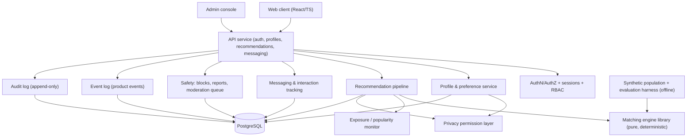

# SYSTEM_ARCHITECTURE.md

> **Status:** DRAFT v0.2 — proposal, not accepted. Items marked **[OPEN]** require a decision
> (see ARCHITECTURE_REVIEW.md). No latency or scale figure here has been measured; all are targets.

## 1. Principles

1. Deterministic, explainable compatibility engine first; no ML in the MVP engine.
2. Compatibility logic is a **pure library** with no I/O, no payment logic, no popularity inputs.
3. Relational database (PostgreSQL) is the authoritative store.
4. Privacy permissions are enforced at the data-access layer, not only in the UI.
5. Every admin action and every matching-rule version is auditable.

## 2. Proposed components

| Component | Responsibility | Depends on |
| :--- | :--- | :--- |
| Matching engine library | `evaluateMatch(userA, userB)` per MATCHING_SPEC; pure functions; versioned ruleset | Ontology/attribute registry |
| Recommendation pipeline | Candidate universe → eligibility → hard constraints → compatibility → mutuality → feasibility → uncertainty → ranking → explanation (spec §16) | Engine, privacy layer, blocks |
| Privacy permission layer | Enforces per-attribute `store / display / searchable / matchable / private / verified` | Data model |
| Exposure monitor | Records exposure, likes received, recommendation frequency, match frequency; feeds popularity control (spec §17) | Events |
| Safety | Blocking, reporting, rate limits, fraud hooks, human-reviewed moderation (no autonomous permanent punishment) | Audit log |
| Evaluation harness | Synthetic populations; baseline comparison (spec §25, §28) | Engine |
| Payments | Isolated module; **must not** be read by the engine or ranking (spec §33) | — |

## 3. Matching engine placement

The engine is a TypeScript package shared by the server (authoritative) and the offline
evaluation harness. The client may display explanations but must **not** be the authority for
eligibility, because client-side evaluation would expose other users' preferences and
sensitive attributes. **[OPEN D-04]** whether any client-side preview is permitted.

## 4. Candidate retrieval

Hard filters (age bounds, mutual gender/orientation eligibility, distance, blocks, self-exclusion,
active status) are applied in SQL before scoring. Scoring runs over the reduced candidate set.
Batch size and caching strategy are **[OPEN]** until measured on synthetic data (Phase 9).

## 5. Targets (unmeasured)

| Target | Value | Status |
| :--- | :--- | :--- |
| Recommendation request p95 | < 500 ms at MVP scale | Target only; to be measured |
| Synthetic population sizes | 10 → 1,000,000 where computationally feasible | Per spec §25 |

## 6. Infrastructure

Hosting, identity provider, message transport, email/SMS, verification vendor, secret manager and
CDN are **unspecified external services** → **[OPEN D-08]**. Per spec §40 these are not chosen
silently.

## 7. Existing code

The current repo is a client-only prototype. `src/utils/matchingEngine.ts` will be **replaced**,
not extended, in Phase 4, because its data model does not match DATA_MODEL.md and it fabricates
defaults for missing data (ARCHITECTURE_REVIEW.md §3). `src/utils/sound.ts` (Web Audio UI sounds)
is unrelated to the matching architecture.
