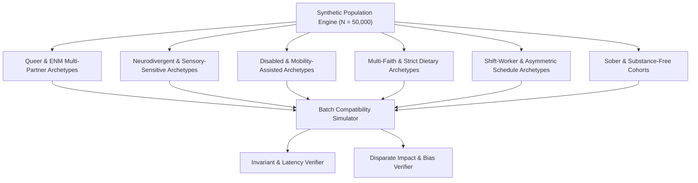

# Universal Compatibility & Matching Platform: Test Plan & Quality Assurance
**Document Version:** 1.0.0  
**Status:** Canonical QA & Invariant Verification Suite  
**Governing Standard:** Section 7 & Section 41 of Master Build Specification  

---

## 1. Testing Philosophy: Mathematical Invariants over Heuristics

Because this platform governs real-world human relationship discovery and strictly rejects engagement gamification, traditional regression tests are insufficient. The testing suite is built around **strict mathematical property invariants, synthetic population generation, and algorithmic fairness audits**.

---

## 2. Invariant Verification Suite

Every continuous integration (CI) run must validate the following 5 fundamental invariants against 100,000 randomized synthetic test pairs:

### 2.1 Invariant 1: Absolute Dealbreaker Gating
$$\forall A, B \quad \left(\exists d \in \mathcal{D}_A : B \text{ violates } d\right) \lor \left(\exists d \in \mathcal{D}_B : A \text{ violates } d\right) \implies S_{\text{mutual}}(A, B) = 0 \land \text{isExcluded} = \text{true}$$
- **Verification Rule:** If User A has dealbreaker "Smoking = Never" and Candidate B smokes socially, Candidate B must receive an absolute zero mutual score, zero recommendation eligibility, and an explicit exclusion reason.

### 2.2 Invariant 2: Epistemic Incompleteness Neutrality
$$\forall A, B, k \quad \text{Score}(A, B \mid B.\text{attr}_k = \text{undefined}) \equiv \text{Score}(A, B \setminus \{k\})$$
- **Verification Rule:** Removing an unpopulated attribute from the calculation must NEVER decrease the compatibility score. Unpopulated fields must only reduce the Confidence Score $C(A, B)$, never the Compatibility Score $S(A, B)$.

### 2.3 Invariant 3: Mutuality Symmetry
$$\forall A, B \quad S_{\text{mutual}}(A, B) \equiv S_{\text{mutual}}(B, A)$$
- **Verification Rule:** Reversing the evaluation arguments must produce identical mutual scores down to 6 decimal precision.

### 2.4 Invariant 4: Confidence Boundedness
$$\forall A, B \quad 0.0 \le C(A, B) \le 1.0$$
- **Verification Rule:** Confidence score must be strictly monotonic with respect to the fraction of known weighted attributes and verification states.

### 2.5 Invariant 5: Zero-Hallucination Explainability Audit
$$\forall \text{explanation } e \in \mathcal{E}(A, B), \quad \exists \text{attribute } k \text{ such that } e \text{ derives deterministically from } (A.\text{attr}_k, B.\text{attr}_k)$$
- **Verification Rule:** Every word and item in the "Top Synergies" and "Identified Frictions" lists must match a static template indexed by the corresponding attribute ID.

---

## 3. Synthetic Population Generator Architecture

To avoid testing bias on narrow demographic samples, the test suite includes an automated generator (`tests/synthetic/populationGenerator.ts`) creating diverse archetypes:

### Profile Archetypes Matrix
1. **Queer & Polyamorous Network:** Non-binary, agender, pansexual, polyamorous profiles with complex relationship structures (e.g. hierarchical and non-hierarchical).
2. **Neurodivergent Synergy Pairs:** Autistic and ADHD profiles with explicit sensory, pacing, and direct communication requirements.
3. **Mobility & Accessibility Cohorts:** Wheelchair users requiring step-free physical venues, sensory calm environments, and sign language communicators.
4. **Cultural / Religious Alignment:** Profiles with strict observance dealbreakers (e.g. Orthodox, Kosher, Halal) vs. secular/interfaith open profiles.
5. **Night-Owl / Shift-Worker Pairs:** Healthcare professionals and emergency workers with night-shift schedules matched against daytime schedules to test temporal compatibility.

---

## 4. Performance, Latency & Load Testing

| Test Suite | Scenario | Scale | Target Threshold |
| :--- | :--- | :--- | :--- |
| **Stage 1 Micro-Benchmark** | Inverted index & PostGIS filtering | $10^6$ active candidates | $p95 < 25\text{ms}$ |
| **Stage 2 Scoring Benchmark** | Full 48-category vector evaluation | $1,000$ candidate batch | $p95 < 85\text{ms}$ |
| **End-to-End Search Pipeline**| Ingress to serialized explainable matches | 500 concurrent RPS | $p95 < 175\text{ms}, p99 < 300\text{ms}$ |
| **Memory Footprint Test** | Worker thread pool during batch eval | 100 worker threads | Memory leak $< 0.1\text{MB/hr}$ |

---

## 5. Algorithmic Fairness & Disparate Impact Audits

The platform integrates continuous fairness metrics into automated testing:

1. **Disparate Impact Ratio (DIR):**
   $$\text{DIR} = \frac{\Pr(\text{Candidate Selected} \mid \text{Protected Group } G_1)}{\Pr(\text{Candidate Selected} \mid \text{Majority Group } G_0)}$$
   *Standard:* Under identical geographic density, the platform mandates $\text{DIR} \ge 0.85$ across all racial, disability, and gender identity cohorts.
2. **Impression Gini Coefficient:**
   $$\text{Gini}(\text{Impressions}) \le 0.40$$
   *Standard:* Measures popularity concentration. Traditional swipe apps have Gini coefficients exceeding $0.80$ (where top 5% of users receive 80% of impressions). The Universal Platform caps the Gini coefficient to guarantee broad, equitable distribution of exposure based purely on authentic mutual compatibility.
